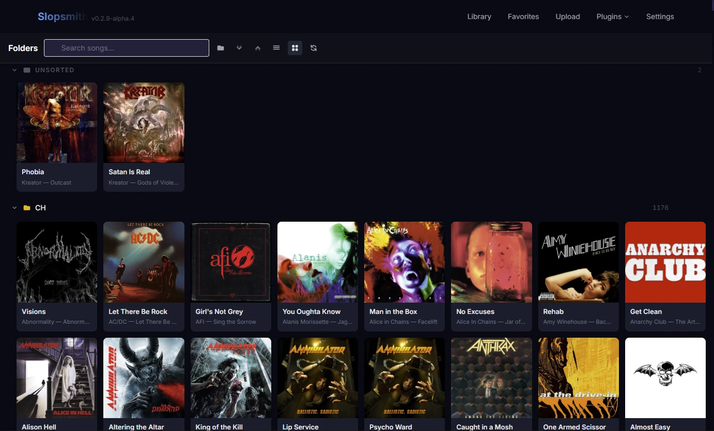
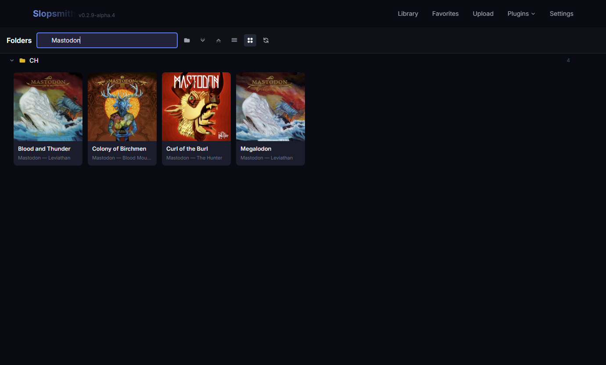
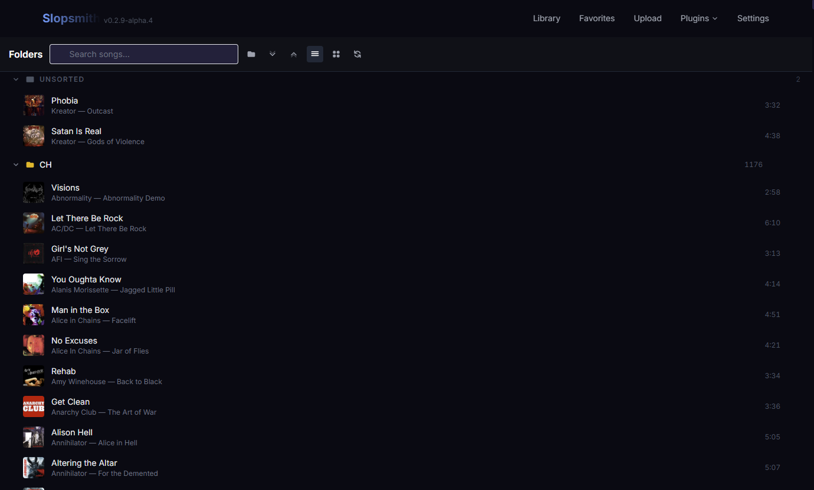
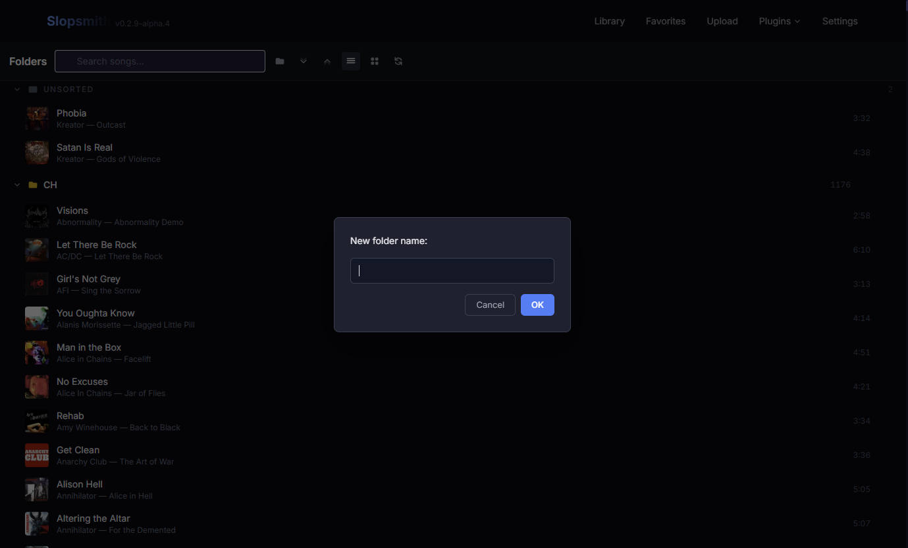

# Folder Organizer — Slopsmith Plugin


A Slopsmith plugin that organizes your sloppak DLC songs into a folder tree view, grouped by subfolder name. Browse your entire library visually with album art, switch between list and grid layouts, and manage folders without ever leaving the app.

---

## Screenshots


*Grid view — album art cards with title and artist*


*Live search filters instantly across all folders*


*List view — compact rows with album art thumbnails and duration*


*Create and manage folders directly in the UI*

---

## Features

- **List & Grid views** — toggle between a compact list with thumbnails or a full album art card grid
- **Album art** — pulls art automatically for every song in both views
- **Folder management** — create, rename, and delete folders without leaving the plugin
- **Move songs** — reassign any song to a different folder on the fly
- **Live search** — filters by title, artist, album, or filename instantly across all folders
- **Collapsible folders** — expand/collapse individual folders, open state saved across sessions
- **Expand All / Collapse All** — manage the whole tree in one click
- **One-click playback** — click any song to start playing immediately
- **Keyboard shortcut** — press `/` to jump to the search box

---

## Installation

1. Open Slopsmith and go to **Plugins → Plugins**
2. Paste the repo URL and click **Install**:

```
https://github.com/Elit3d/slopsmith-plugin-folder-organizer.git
```

3. The **Folders** screen will appear in the navbar under **Plugins**

---

## Usage

| Action | How |
|--------|-----|
| Switch to grid view | Click the grid icon in the toolbar |
| Switch to list view | Click the list icon in the toolbar |
| Play a song | Click any song row or card |
| Search | Type in the search box or press `/` |
| Create a folder | Click the folder+ icon in the toolbar |
| Rename a folder | Hover the folder header → click the pencil icon |
| Delete a folder | Hover the folder header → click the trash icon |
| Move a song | Hover the song row → click the folder icon |
| Expand / collapse a folder | Click the folder header |

---

## Changelog

### v1.4
- List view with album art thumbnails on every song row
- Grid view with full album art cards
- List/grid toggle in the toolbar, preference saved across sessions

### v1.3
- Folder management — create, rename, and delete folders directly in the UI
- Move songs between folders via the hover menu

### v1.0
- Initial release
- Folder tree view grouped by DLC subfolder name
- Collapsible folders with state saved across sessions
- Live search filtering by title, artist, album, or filename
- One-click playback
- Expand All / Collapse All
- `/` keyboard shortcut to focus search

---

## Roadmap

- [ ] Drag-and-drop songs between folders
- [ ] Sort options within folders (by title, artist, or duration)
- [ ] Nested subfolders
- [ ] Auto play song on hover (ability to turn this function on/off)
- [ ] Bulk move — select multiple songs and move them at once
- [ ] Thumbnail performance — faster loading and smoother scrolling with large song libraries

---

## Contributing

Pull requests are welcome. For major changes please open an issue first to discuss what you'd like to change.

1. Fork the repo
2. Create a feature branch (`git checkout -b feature/your-feature`)
3. Commit your changes
4. Push to the branch and open a pull request
